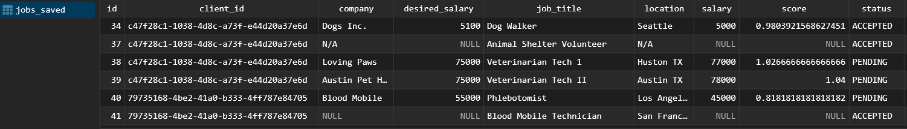

# Job Organizer
**Job Organizer** is a web application designed to help users track and manage job applications efficiently. Users can add, remove, and view jobs, with persistence maintained per device.

## Link 
**https://job-organizer-api.onrender.com/**

<b>Frontend</b>

  

<b>Backend</b>

  

## Features

- **Add and Remove Jobs:** Users can create new job entries and remove them as needed.
- **Device-Based Persistence:** Each device is assigned a unique UUID, so job entries are saved and persist relative to that device.
- **Job Details:** Tracks company, job title, location, salary, desired salary, status, and a computed score.
- **Database Management:** Uses TablePlus for managing the PostgreSQL database.
- **Responsive Frontend:** Clean table-based interface with icons and styling for clarity.

## Technologies

- **Backend:** Spring Boot (Java)
- **Frontend:** HTML, CSS, JavaScript
- **Database:** PostgreSQL (managed via TablePlus)
- **Deployment:** Render (hosting and live access)
- **Additional Libraries:** Font Awesome for icons

## Usage

1. Access the app via the deployed Render URL.
2. Add job details in the form and submit; entries will appear in the table.
3. Remove jobs using the delete button; changes are reflected immediately in the database.
4. Data is persistent for your device via a generated UUID.

## Notes
- This application stores a randomly generated anonymous client ID in the browser to associate job entries with a device. No personal data or device identifiers are collected.
- Each device has its own data set; clearing browser data may reset the UUID and associated jobs.
- Deployed version on Render requires the backend to be running for live access.
